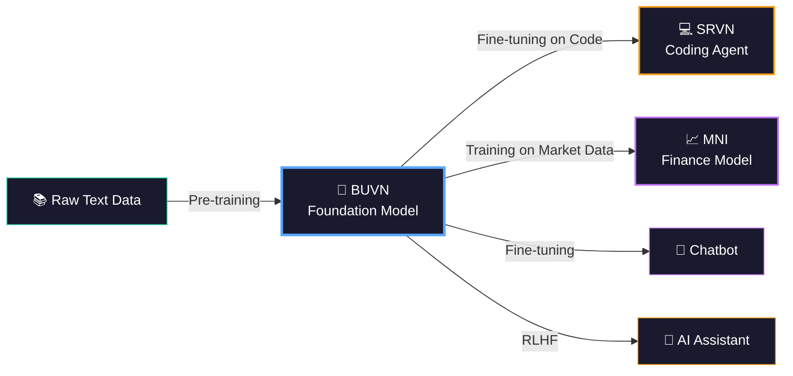
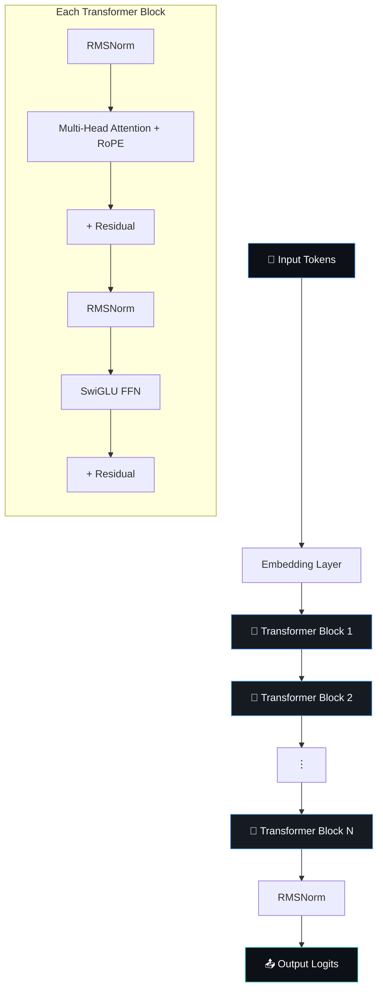

<!-- ═══════════════════════════════════════════════════════════════════════════
     🧠 BUVN-1.1 — Foundation Language Model
     Built from scratch by Bhuvan
═══════════════════════════════════════════════════════════════════════════ -->

<div align="center">

<!-- Animated SVG Header -->


<!-- Animated Typing -->
<a href="#">
  
</a>

<br/>

<!-- Animated Badges -->
[](https://python.org)
[](https://pytorch.org)
[](https://fastapi.tiangolo.com)
[](https://huggingface.co/datasets)
[](LICENSE)

<br/>

<!-- Star/Fork Animation Badges -->


<br/><br/>

<!-- Quick Nav with Emojis -->
[📥 Install](#-step-0--install-dependencies) · [📊 Download Data](#-step-1--download-the-dataset) · [🔤 Tokenizer](#-step-2--train-the-tokenizer) · [🏋️ Train](#-step-4--train-the-model) · [🧪 Inference](#-step-5--run-inference) · [🌐 API](#-step-6--start-the-api-server) · [📈 Results](#-training-results)

</div>

<br/>

<!-- Animated Divider -->


<br/>

## 🎯 What is BUVN-1.1?

<table>
<tr>
<td width="60%">

**BUVN-1.1** is a complete, production-quality codebase for training a **GPT-style language model from scratch.**

It covers the entire ML pipeline — from downloading raw text from the internet, to serving inference via a REST API.

> *"The best way to understand how large language models work is to build one yourself."*

</td>
<td width="40%">

```
🌐 Raw Text (WikiText-103)
      ↓
🧹 Clean & Filter
      ↓
🔤 Train BPE Tokenizer
      ↓
📦 Tokenize → Binary
      ↓
🏋️ Train Transformer
      ↓
🧪 Generate Text
      ↓
🌐 Deploy as API
```

</td>
</tr>
</table>

<br/>

## 💡 What is a Foundation Model?

<div align="center">



</div>

A **foundation model** is a neural network trained on massive unlabeled text. BUVN-1.1 implements the **pre-training** step — the foundation upon which the entire **Beuvian ecosystem** is built. BUVN's trained weights are inherited by **SRVN** (coding agent) and **MNI** (finance model), giving them a massive head start on understanding language before they specialize.

> 📘 **See the full ecosystem overview:** [Beuvian README](../README.md)

<br/>

<!-- Animated Divider -->


<br/>

## 🏗 Architecture

<div align="center">



</div>

<details>
<summary>🔍 <b>Click to expand: Model Specifications</b></summary>
<br/>

| Parameter | 🖥️ CPU Test Config | ☁️ Production Config |
|-----------|:---:|:---:|
| **Parameters** | ~2M | ~120M |
| **Layers** | 4 | 12 |
| **Attention Heads** | 4 | 12 |
| **Embedding Dim** | 128 | 768 |
| **Context Length** | 128 tokens | 512 tokens |
| **Vocab Size** | 8,000 | 50,000 |
| **Positional Encoding** | RoPE ✅ | RoPE ✅ |
| **Activation** | SwiGLU ✅ | SwiGLU ✅ |
| **Normalization** | RMSNorm ✅ | RMSNorm ✅ |
| **Attention** | Flash (SDPA) ✅ | Flash (SDPA) ✅ |

</details>

<br/>

<!-- Animated Divider -->


<br/>

## 📂 Project Structure

```
BUVN-1.1/
│
├── 🧠 model/                          Core neural network
│   ├── config.py                      Model hyperparameters dataclass
│   ├── model.py                       Transformer, Attention, RoPE, SwiGLU
│   └── utils.py                       Device detection helpers
│
├── 🔤 tokenizer/                      Tokenizer scripts
│   └── train_tokenizer.py             SentencePiece trainer (alternative)
│
├── 🏋️ training/                       Training pipeline
│   ├── config.py                      YAML config parser
│   ├── dataloader.py                  Memory-mapped binary data loader
│   └── train.py                       AdamW + cosine LR + mixed precision
│
├── 🧪 inference/                      Text generation
│   ├── sample.py                      Top-k sampling with temperature
│   └── generate.py                    CLI generator & model loader
│
├── 🌐 api/                            FastAPI deployment
│   ├── app.py                         Server startup + CORS
│   └── routes.py                      POST /generate endpoint
│
├── ⚙️ scripts/                        Pipeline utilities
│   ├── prepare_data.py                WikiText-103 streaming downloader
│   ├── train_hf_tokenizer.py          HuggingFace BPE tokenizer trainer
│   ├── tokenize_corpus.py             Text → train.bin / val.bin
│   ├── test_inference.py              Quick inference test
│   └── convert_to_hf.py              Export to HuggingFace format
│
├── 📋 configs/
│   └── train_config.yaml              All hyperparameters
│
├── 📄 requirements.txt                Python dependencies
├── 📄 .env.example                    Environment template
├── 📄 .gitignore                      Excludes generated files
└── 📘 README.md                       You are here!
```

> 💡 Directories like `data/processed/`, `checkpoints/`, and `tokenizer/tokenizer.json` are **auto-generated** by the pipeline scripts and excluded from Git.

<br/>

<!-- Animated Divider -->


<br/>

## 🔄 Reproducibility — Clone & Run

<div align="center">

> **Everything in this repo is fully reproducible.** The large generated files (corpus, tokenizer, checkpoints) are excluded from Git because they can be regenerated by running the pipeline.

</div>

<table>
<tr>
<th>✅ Committed to Git (source code)</th>
<th>🚫 Gitignored (generated, reproducible)</th>
</tr>
<tr>
<td>

| File | Purpose |
|------|---------|
| `scripts/prepare_data.py` | Downloads dataset |
| `scripts/train_hf_tokenizer.py` | Trains tokenizer |
| `scripts/tokenize_corpus.py` | Creates binaries |
| `training/train.py` | Trains model |
| `inference/generate.py` | Generates text |
| `api/app.py` + `routes.py` | Serves API |
| `model/*.py` | Architecture code |
| `configs/train_config.yaml` | Hyperparameters |
| `requirements.txt` | Dependencies |

</td>
<td>

| File | Regenerated By |
|------|----------------|
| `corpus.txt` (283 MB) | Step 1 command |
| `tokenizer.json` (540 KB) | Step 2 command |
| `train.bin` (147 MB) | Step 3 command |
| `val.bin` (1.5 MB) | Step 3 command |
| `ckpt.pt` (34 MB) | Step 4 command |
| `__pycache__/` | Python auto-gen |
| `venv/` | pip auto-gen |

</td>
</tr>
</table>

All directories (`data/processed/`, `checkpoints/`, etc.) are **automatically created** by the scripts — no manual setup needed.

<br/>

<!-- Animated Divider -->


<br/>

## 🚀 Quick Start — All Commands at a Glance

```bash
git clone <your-repo-url> && cd BUVN-1.1
pip install -r requirements.txt
export PYTHONPATH=$(pwd)                                              # Step 0
python scripts/prepare_data.py --max_size_mb 300                      # Step 1
python scripts/train_hf_tokenizer.py --vocab_size 8000                # Step 2
python scripts/tokenize_corpus.py                                     # Step 3
python training/train.py --config configs/train_config.yaml           # Step 4
python inference/generate.py --prompt "AI is" --checkpoint checkpoints/ckpt.pt --tokenizer tokenizer/tokenizer.json  # Step 5
python api/app.py --checkpoint checkpoints/ckpt.pt --tokenizer tokenizer/tokenizer.json  # Step 6
```

<br/>

<!-- Animated Divider -->


<br/>

## 📘 Step-by-Step Guide

<!-- ==================== STEP 0 ==================== -->
### 📥 Step 0 — Install Dependencies

<table><tr><td>

**Clone the repository:**
```bash
git clone <your-repo-url>
cd BUVN-1.1
```

**Create virtual environment:**
```bash
python -m venv venv

# Windows PowerShell:
venv\Scripts\activate

# Linux / Mac:
source venv/bin/activate
```

**Install packages:**
```bash
pip install -r requirements.txt
```

**⚠️ Set PYTHONPATH (required — do this in every new terminal):**
```bash
# Windows PowerShell:
$env:PYTHONPATH = "C:\full\path\to\BUVN-1.1"

# Linux / Mac:
export PYTHONPATH=$(pwd)
```

</td></tr></table>

<br/>

<!-- ==================== STEP 1 ==================== -->
### 📊 Step 1 — Download the Dataset

<table><tr><td>

**What it does:** Streams WikiText-103 from HuggingFace, filters out junk, and saves clean text. No full download — streams sample by sample. Stops automatically at target size.

**Command:**
```bash
python scripts/prepare_data.py --max_size_mb 300
```

**Options:**

| Flag | Default | Description |
|------|---------|-------------|
| `--max_size_mb` | `150` | Stop when corpus reaches this size |
| `--min_length` | `100` | Skip lines shorter than this (chars) |
| `--output` | `data/processed/corpus.txt` | Output path |

**Example — quick test with 5 MB:**
```bash
python scripts/prepare_data.py --max_size_mb 5
```

</td></tr></table>

<details>
<summary>📋 <b>Click to see: Expected terminal output</b></summary>

```
Loading WikiText-103 (streaming mode)...
Processed 100,000 samples | Written 57,723 | Size: 38.3 MB
Processed 200,000 samples | Written 109,651 | Size: 75.2 MB
Processed 300,000 samples | Written 167,892 | Size: 115.4 MB
Processed 400,000 samples | Written 220,134 | Size: 152.6 MB
...
Done! Corpus saved to: data/processed/corpus.txt
  Total samples scanned : 837,542
  Total lines written   : 424,310
  Final file size       : 283.2 MB
```
</details>

<details>
<summary>🔀 <b>Click to see: How to switch to C4 for production</b></summary>

Change one line in `scripts/prepare_data.py`:
```python
# Replace:
dataset = load_dataset("wikitext", "wikitext-103-raw-v1", split="train", streaming=True)

# With:
dataset = load_dataset("allenai/c4", "en", split="train", streaming=True)
```
Then set `--max_size_mb 5000` or higher.
</details>

<br/>

<!-- ==================== STEP 2 ==================== -->
### 🔤 Step 2 — Train the Tokenizer

<table><tr><td>

**What it does:** Trains a Byte-Level BPE tokenizer on your corpus. Two options:

**Option A — HuggingFace tokenizers (recommended):**
```bash
python scripts/train_hf_tokenizer.py --corpus data/processed/corpus.txt --vocab_size 8000
```

**Option B — SentencePiece (alternative):**
```bash
python tokenizer/train_tokenizer.py --input_file data/processed/corpus.txt --vocab_size 50000
```

**Options (Option A):**

| Flag | Default | Description |
|------|---------|-------------|
| `--corpus` | `data/processed/corpus.txt` | Input text corpus |
| `--output` | `tokenizer/tokenizer.json` | Output tokenizer |
| `--vocab_size` | `4000` | BPE vocabulary size |

</td></tr></table>

<details>
<summary>📋 <b>Click to see: Expected output</b></summary>

```
Training BPE tokenizer on data/processed/corpus.txt (vocab_size=8000)...
Tokenizer saved to: tokenizer/tokenizer.json
Vocab size: 8000

Test encode: 'AI is transforming the world.' -> [2, 36, 44, 321, 5582, 238, 213, 1220, 17, 3]
Test decode: 'AI is transforming the world.'
```
</details>

<br/>

<!-- ==================== STEP 3 ==================== -->
### 📦 Step 3 — Tokenize Corpus into Binary

<table><tr><td>

**What it does:** Converts corpus.txt into memory-mapped binary files (.bin) that the training dataloader reads at maximum speed.

**Command:**
```bash
python scripts/tokenize_corpus.py
```

**Options:**

| Flag | Default | Description |
|------|---------|-------------|
| `--corpus` | `data/processed/corpus.txt` | Input text |
| `--tokenizer` | `tokenizer/tokenizer.json` | Tokenizer to use |
| `--output_dir` | `data/processed` | Output directory |
| `--val_ratio` | `0.01` | Validation split ratio |

</td></tr></table>

<details>
<summary>📋 <b>Click to see: Expected output</b></summary>

```
Loaded tokenizer (vocab size: 8000, EOS id: 3)
  Tokenized 100,000 lines | 17,461,238 tokens
  Tokenized 200,000 lines | 35,082,109 tokens
  Tokenized 300,000 lines | 52,647,382 tokens
  Tokenized 400,000 lines | 70,250,999 tokens

Total lines: 424,310
Total tokens: 74,476,112
Train tokens: 73,731,350
Val tokens:   744,762
Saved data/processed/train.bin (147.5 MB)
Saved data/processed/val.bin (1.5 MB)
```
</details>

<br/>

<!-- ==================== STEP 4 ==================== -->
### 🏋️ Step 4 — Train the Model

<table><tr><td>

**What it does:** Trains the transformer model using AdamW optimizer, cosine LR decay, gradient clipping, and mixed precision.

**Command:**
```bash
python training/train.py --config configs/train_config.yaml
```

**Configuration** (`configs/train_config.yaml`):
```yaml
model:
  vocab_size: 8000        # Must match tokenizer
  d_model: 128            # Embedding dimension
  n_layers: 4             # Transformer layers
  n_heads: 4              # Attention heads
  max_seq_len: 128        # Context window

training:
  batch_size: 8
  max_iters: 500          # Training steps
  lr: 0.001               # Peak learning rate
  warmup_iters: 50        # LR warmup period
  eval_interval: 100      # Evaluate every N steps
  checkpoint_dir: "checkpoints"

data:
  data_dir: "data/processed"
```

> 💡 **Tip:** For production on GPU, increase `d_model: 768`, `n_layers: 12`, `vocab_size: 50000`, and `max_iters: 50000+`

</td></tr></table>

<details>
<summary>📋 <b>Click to see: Expected training output</b></summary>

```
Using device: cpu, dtype: float16
Loaded 73,731,350 tokens from data/processed/train.bin
Initializing model...
Model parameters: 2.11 M

step 0:   train loss 9.0148, val loss 8.9822   ← random weights
iter 10:  loss 8.7215, lr 2.000e-04
iter 50:  loss 7.6243, lr 6.000e-04             ← learning!
step 100: train loss 6.8694, val loss 6.8527
step 200: train loss 6.6183, val loss 6.5813
step 300: train loss 6.3728, val loss 6.3337
step 400: train loss 6.2461, val loss 6.2844
step 499: train loss 6.1760, val loss 6.1997    ← converging ✅
saving checkpoint to checkpoints
```
</details>

<br/>

<!-- ==================== STEP 5 ==================== -->
### 🧪 Step 5 — Run Inference

<table><tr><td>

**What it does:** Loads the trained model and generates text from a prompt using top-k sampling.

**Command:**
```bash
python inference/generate.py \
    --prompt "The history of" \
    --checkpoint checkpoints/ckpt.pt \
    --tokenizer tokenizer/tokenizer.json \
    --max_new_tokens 80 \
    --temperature 0.8 \
    --top_k 40
```

**Options:**

| Flag | Default | Description |
|------|---------|-------------|
| `--prompt` | *(required)* | Input text to complete |
| `--checkpoint` | `checkpoints/ckpt.pt` | Trained model file |
| `--tokenizer` | `tokenizer/tokenizer.json` | Tokenizer file |
| `--max_new_tokens` | `100` | Max tokens to generate |
| `--temperature` | `0.8` | Creativity (higher = wilder) |
| `--top_k` | `200` | Token pool size |

</td></tr></table>

<details>
<summary>📋 <b>Click to see: Example output</b></summary>

```
Prompt: "The history of"
--------------------------------------------------
Output: SG @-@ season , the two of the Ure 's CP. The series
        of the next 54th century , and Cangan .
--------------------------------------------------
Tokens Used: {'prompt_tokens': 5, 'completion_tokens': 50, 'total_tokens': 55}
```

> ⚠️ Text quality is rough with a tiny CPU model — this is expected. On GPUs with 120M params, results improve dramatically.

</details>

<br/>

<!-- ==================== STEP 6 ==================== -->
### 🌐 Step 6 — Start the API Server

<table><tr><td>

**What it does:** Deploys your trained model behind a FastAPI server with Swagger docs.

**Command:**
```bash
python api/app.py \
    --checkpoint checkpoints/ckpt.pt \
    --tokenizer tokenizer/tokenizer.json \
    --port 8000
```

**Options:**

| Flag | Default | Description |
|------|---------|-------------|
| `--host` | `0.0.0.0` | Bind address |
| `--port` | `8000` | Port number |
| `--checkpoint` | `checkpoints/ckpt.pt` | Model file |
| `--tokenizer` | `tokenizer/tokenizer.json` | Tokenizer file |

</td></tr></table>

<br/>

#### 📚 Interactive API Documentation

Once the server is running, open these URLs in your browser:

<div align="center">

| 🔗 URL | Description |
|:------:|-------------|
| **http://127.0.0.1:8000/docs** | 🟢 **Swagger UI** — Interactive API explorer with "Try it out" |
| **http://127.0.0.1:8000/redoc** | 📘 **ReDoc** — Beautiful alternative documentation |

</div>

#### 📮 Test with Postman

Copy this into **Postman → Import → Raw Text**:

```bash
curl --location 'http://127.0.0.1:8000/generate' \
--header 'Content-Type: application/json' \
--data '{"prompt": "The history of science", "max_tokens": 60, "temperature": 0.8, "top_k": 40}'
```

#### 📡 Endpoint: `POST /generate`

<table>
<tr>
<td width="50%">

**Request:**
```json
{
    "prompt": "The history of science",
    "max_tokens": 60,
    "temperature": 0.8,
    "top_k": 40
}
```

</td>
<td width="50%">

**Response:**
```json
{
    "generated_text": "The most of his first...",
    "usage": {
        "prompt_tokens": 6,
        "completion_tokens": 60,
        "total_tokens": 66
    },
    "latency_ms": 293.56
}
```

</td>
</tr>
</table>

<details>
<summary>📐 <b>Click to expand: Full API Schema</b></summary>

**Request fields:**

| Field | Type | Default | Range | Description |
|-------|------|---------|-------|-------------|
| `prompt` | `string` | *(required)* | — | Input text |
| `max_tokens` | `int` | 100 | 1–512 | Max generation length |
| `temperature` | `float` | 0.7 | 0.0–2.0 | Randomness |
| `top_k` | `int` | 50 | ≥ 0 | Token pool filter |

**Response fields:**

| Field | Type | Description |
|-------|------|-------------|
| `generated_text` | `string` | Model's continuation |
| `usage.prompt_tokens` | `int` | Input token count |
| `usage.completion_tokens` | `int` | Generated token count |
| `usage.total_tokens` | `int` | Sum |
| `latency_ms` | `float` | Processing time (ms) |

</details>

<br/>

<!-- Animated Divider -->


<br/>

## 📈 Training Results

<div align="center">

### 🏆 WikiText-103 Test Run (283 MB Corpus)

</div>

| Metric | Value |
|--------|-------|
| 📊 **Corpus Size** | 283.2 MB (424,310 clean lines) |
| 🔤 **Tokenizer** | BPE, 8,000 vocab |
| 🔢 **Total Tokens** | 74,476,112 (74.5M) |
| 🧠 **Model** | 4 layers, 128 dim, 4 heads (~2.1M params) |
| ⏱️ **Training** | 500 iterations on CPU |
| 📉 **Final Train Loss** | 6.18 |
| 📉 **Final Val Loss** | 6.20 |

```
📉 Training Loss Curve

  9.0 ┤●
      │ ╲
  8.5 ┤  ╲
      │   ╲
  8.0 ┤    ╲
      │     ╲
  7.5 ┤      ╲
      │       ╲
  7.0 ┤        ╲
      │         ╲──╲
  6.5 ┤              ╲───╲
      │                   ╲───╲
  6.0 ┤                        ╲────── 6.18 ✅
      └────────────────────────────────────
      0    100   200   300   400   500
                  iterations →
```

<br/>

<!-- Animated Divider -->


<br/>

## 🏆 BUVN-2.0 Results — Beat GPT-2 Small!

<div align="center">

### Trained on NVIDIA H100 NVL | 109.5M Parameters | PPL 29.19

</div>

| Metric | BUVN-1.1 (10M) | BUVN-2.0 (125M) | Improvement |
|--------|:-:|:-:|:-:|
| **Val Perplexity** | 35.87 | **29.19** | 18.6% better |
| **Parameters** | 13.69M | **109.53M** | 8x |
| **Vocab** | 8K | **32K** | 4x |
| **Context** | 512 | **1024** | 2x |
| **Training Data** | 13M tokens | **2B tokens** | 154x |
| **Top-1 Accuracy** | 36.30% | **37.88%** | +1.6% |
| **Top-5 Accuracy** | 56.84% | **60.34%** | +3.5% |
| **Overfit Gap** | 0.62 (overfitting) | **0.03 (healthy)** | Fixed |
| **Training Time** | 5 min | **~2 hours** | — |
| **Leaderboard** | #11/11 | **#8/11** | Beat GPT-2 Small! |

<details>
<summary>📊 <b>Click to expand: Full Leaderboard</b></summary>

| Rank | Model | Params | PPL | Tokens | Org |
|:----:|-------|:------:|:---:|:------:|-----|
| 1 | LLaMA-2 7B | 7B | 5.47 | 2T | Meta |
| 2 | LLaMA 7B | 7B | 7.73 | 1T | Meta |
| 3 | Pythia-1B | 1B | 16.71 | 300B | EleutherAI |
| 4 | GPT-2 Large | 774M | 19.93 | ~40B | OpenAI |
| 5 | GPT-2 Medium | 355M | 22.76 | ~40B | OpenAI |
| 6 | OPT-125M | 125M | 27.65 | 300B | Meta |
| 7 | RWKV-169M | 169M | 29.01 | 300B | RWKV |
| **8** | **BUVN-2.0 (ours)** | **109.5M** | **29.19** | **2B** | **Bhuvan** |
| 9 | Pythia-160M | 160M | 29.33 | 300B | EleutherAI |
| 10 | GPT-2 Small | 124M | 29.41 | ~40B | OpenAI |
| 11 | GPT-Neo 125M | 125M | 32.43 | 300B | EleutherAI |

</details>

> 📘 **Full benchmark details:** See [docs/benchmarks.md](docs/benchmarks.md)

<br/>

<!-- Animated Divider -->


<br/>

## 📚 Documentation

| Guide | Description |
|-------|-------------|
| [Setup & Installation](docs/setup.md) | Prerequisites, installation, troubleshooting |
| [Usage Guide](docs/usage.md) | CLI inference, API server, sampling parameters |
| [Training Guide](docs/training.md) | Full 6-step pipeline, config explained, monitoring |
| [Scaling to Production](docs/scaling.md) | Parallel data streaming, batch optimization, cost estimates |
| [Fine-Tuning Guide](docs/fine-tuning.md) | SFT, RLHF, DPO, LoRA, instruction tuning |
| [Model Architecture](docs/architecture.md) | Transformer internals, RoPE, RMSNorm, SwiGLU |
| [Benchmark Results](docs/benchmarks.md) | Full metrics, leaderboard, gap analysis |

<br/>

<!-- Animated Divider -->


<br/>

## 💾 Using the Checkpoint (.pt) File

<details>
<summary>📦 <b>Click to expand: What's inside a checkpoint</b></summary>

| Key | Type | Contents |
|-----|------|----------|
| `checkpoint['model']` | `dict` | Model weights (state_dict) |
| `checkpoint['optimizer']` | `dict` | Optimizer state |
| `checkpoint['model_args']` | `dict` | Config: vocab_size, d_model, etc. |
| `checkpoint['iter_num']` | `int` | Last training iteration |

</details>

**Load a trained model:**
```python
import torch
from model.config import BUVNConfig
from model.model import BUVNModel

ckpt = torch.load('checkpoints/ckpt.pt', map_location='cpu')
config = BUVNConfig.from_dict(ckpt['model_args'])
model = BUVNModel(config)
model.load_state_dict(ckpt['model'])
model.eval()
```

**Resume training:**
```python
optimizer.load_state_dict(ckpt['optimizer'])
start_iter = ckpt['iter_num']
```

<br/>

<!-- Animated Divider -->


<br/>

## 💻 Hardware Requirements

<div align="center">

| | Setup | Hardware | Use Case |
|:-:|-------|----------|----------|
| 🟢 | **CPU** | Any CPU, 8 GB RAM | Testing & validation |
| 🟡 | **Single GPU** | RTX 3080/4080/T4 (16 GB) | Small training runs |
| 🔵 | **Cloud GPU** | Azure NC A100 v4 (40–80 GB) | Full 120M model |
| 🟣 | **Multi-GPU** | 4× A100 with DDP | Production scale |

</div>

> 💰 **Cost estimate:** 1× A100 on Azure (~$3–4/hr) × ~25 hours = **< $150** to train the full 120M model.

<br/>

## 💰 Token Pricing Concept

Every API response includes a `usage` object — exactly like OpenAI/Claude APIs:

```json
"usage": {
    "prompt_tokens": 6,       // ← what you sent
    "completion_tokens": 60,  // ← what was generated  
    "total_tokens": 66        // ← billable count
}
```

Plug into Stripe or any billing system for per-token pricing.

<br/>

## ⚠️ Limitations

| ⚠️ Limitation | 💬 Explanation |
|:---:|---|
| Not instruction-tuned | Predicts next tokens, won't "answer" questions |
| Hallucinations | Small models fabricate facts frequently |
| 128-token context | Limited window for CPU testing (512 in prod) |
| English only | WikiText-103 is English-only |
| Rough quality | Tiny model + limited iters = incoherent output |

<br/>

## 🔮 Future Roadmap

### 🧠 BUVN — Foundation Model Evolution

- [x] 🎯 **DONE** — Scaled to **109.5M parameters** on H100 NVL GPU
- [x] 📚 **DONE** — Switched to **C4 dataset** (2B tokens streamed via 8 parallel workers)
- [x] ⚡ **DONE** — **torch.compile** for 1.5x training speedup
- [x] 📏 **DONE** — **1024 token context**, 32K vocabulary
- [x] 🏆 **DONE** — **PPL 29.19** — Beat GPT-2 Small (29.41)! Rank #8/11 on leaderboard
- [ ] 💬 **Supervised Fine-Tuning** on prompt/response pairs (OpenAssistant + Alpaca)
- [ ] 🧭 **RLHF / DPO** alignment
- [ ] 🖥️ **Multi-GPU DDP** distributed training
- [ ] 📦 **INT8/INT4 Quantization** for faster inference

### 💻 SRVN — Coding Agent Model (Fine-tuned from BUVN)

SRVN is the next evolution — a **coding agent** that inherits BUVN's language understanding and specializes in code generation, debugging, review, and autonomous agentic workflows.

- [ ] 📦 Curate code training corpus (**The Stack v2**, GitHub, 500GB+)
- [ ] 🔤 Extend tokenizer with **code-specific vocabulary** (64K tokens — indentation, brackets, operators)
- [ ] 🔧 **Fine-tune BUVN checkpoint** on multi-language code data (Python, JS, Rust, Go, Java, C++)
- [ ] 🧩 Implement **Fill-in-the-Middle (FIM)** training for code infilling
- [ ] 📋 **Instruction-tune** on coding task datasets (CodeAlpaca, Code-Instruct)
- [ ] 🤖 Build **agentic framework** — Plan → Code → Test → Debug → Iterate autonomously
- [ ] 🧪 Benchmark on **HumanEval**, **MBPP**, **SWE-bench**
- [ ] 🌐 Deploy as **coding assistant API** with tool-use capabilities

### 📈 MNI — Finance Model (Trained on Market Data)

MNI is the financial intelligence arm — trained on **stock market data, SEC filings, earnings calls, and financial news** to become a multi-modal financial reasoning engine.

- [ ] 📊 Build financial data pipeline (**SEC EDGAR**, Yahoo Finance, news APIs, Alpha Vantage)
- [ ] 🔢 Design **numeric-aware tokenization** for price, volume, and ratio data
- [ ] 🏋️ **Domain pre-train** BUVN on financial corpus (10-K/Q filings, earnings transcripts, textbooks)
- [ ] 📰 Train **sentiment analysis** on earnings calls, financial news, and social media
- [ ] 📉 Build **market prediction head** (price direction + magnitude regression + classification)
- [ ] 🧪 **Backtest** signal quality with walk-forward validation and out-of-sample testing
- [ ] 🌐 Deploy as **financial analysis API** (sentiment scores, risk metrics, research summaries)
- [ ] 📋 Build **dashboard** for real-time market intelligence and portfolio monitoring

### 🌐 Beuvian Ecosystem Integration

- [ ] 🔀 **Unified API gateway** — single endpoint routing to BUVN / SRVN / MNI
- [ ] 🤝 **Cross-model orchestration** — SRVN writes quant strategies, MNI evaluates them
- [ ] 📦 **HuggingFace Hub publication** for all model weights
- [ ] 🎮 **Web playground** for interactive demos across all three models
- [ ] 🔄 **Model versioning** and A/B testing infrastructure

> 📘 **Full ecosystem details:** See the [Beuvian Ecosystem README](../README.md) for the complete vision, architecture, and technical deep dives on SRVN and MNI.

<br/>

<!-- Animated Divider -->


<br/>

<div align="center">

<!-- Animated Footer -->


**Built with ❤️ by Bhuvan**

*BUVN-1.1 — The foundation of the [Beuvian Ecosystem](../README.md). One model to power them all.*

<br/>


</div>
