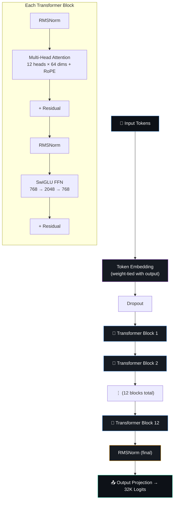
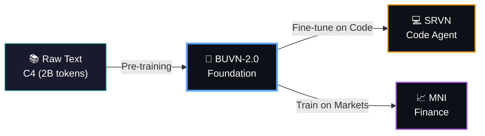

---
language:
- en
license: mit
tags:
- text-generation
- transformer
- pytorch
- from-scratch
- foundation-model
- language-model
- gpt
- llm
datasets:
- allenai/c4
pipeline_tag: text-generation
library_name: pytorch
model-index:
- name: BUVN-2.0
  results:
  - task:
      type: text-generation
      name: Language Modeling
    dataset:
      type: wikitext
      name: WikiText-103
    metrics:
    - type: perplexity
      value: 29.19
      name: Perplexity
    - type: accuracy
      value: 37.88
      name: Top-1 Accuracy
    - type: accuracy
      value: 60.34
      name: Top-5 Accuracy
---

<div align="center">

<!-- Header Banner -->


<!-- Typing Animation -->
<a href="https://github.com/bhuvan0808/beuvian">
  
</a>

<br/>

<!-- Badges Row 1 -->
[](https://github.com/bhuvan0808/beuvian)
[](https://github.com/bhuvan0808/beuvian)
[](https://github.com/bhuvan0808/beuvian)

<!-- Badges Row 2 -->
[](https://pytorch.org)
[](https://www.nvidia.com)
[](https://github.com/bhuvan0808/beuvian/blob/main/LICENSE)
[](https://github.com/bhuvan0808/beuvian)

<br/>

<!-- Status Badges -->


</div>

<br/>

<!-- Divider -->


## What is BUVN-2.0?

**BUVN-2.0** is a **109.5 million parameter** GPT-style decoder-only transformer language model, **built entirely from scratch** — no pretrained weights, no fine-tuning shortcuts. Trained on **2 billion tokens** from the C4 dataset on a single **NVIDIA H100 NVL GPU** in approximately **2 hours**.

It is the foundation model of the **[Beuvian AI Ecosystem](https://github.com/bhuvan0808/beuvian)** — a family of three specialized models:

<div align="center">

```
         ╔═══════════════════════════════════╗
         ║  🧠 BUVN-2.0 (Foundation Model)  ║
         ║  109.5M params  |  PPL 29.19     ║
         ╚════════════╦════════════╦════════╝
                      ║            ║
              ╔═══════╩═══╗  ╔════╩════════╗
              ║ 💻 SRVN   ║  ║  📈 MNI     ║
              ║ Code Agent ║  ║  Finance    ║
              ║ (Planned)  ║  ║  (Planned)  ║
              ╚═══════════╝  ╚═════════════╝
```

</div>

> *"Don't just use AI. Understand it. Build it. Own it."*

<br/>

<!-- Divider -->


## Model Performance

<div align="center">

### 🏆 WikiText-103 Perplexity Leaderboard

</div>

| Rank | Model | Organization | Parameters | PPL (↓) | Training Tokens |
|:----:|-------|:------------:|:----------:|:-------:|:---------------:|
| 1 | LLaMA-2 7B | Meta | 7B | 5.47 | 2T |
| 2 | LLaMA 7B | Meta | 7B | 7.73 | 1T |
| 3 | Pythia-1B | EleutherAI | 1B | 16.71 | 300B |
| 4 | GPT-2 Large | OpenAI | 774M | 19.93 | ~40B |
| 5 | GPT-2 Medium | OpenAI | 355M | 22.76 | ~40B |
| 6 | OPT-125M | Meta | 125M | 27.65 | 300B |
| 7 | RWKV-169M | RWKV | 169M | 29.01 | 300B |
| **8** | **🟢 BUVN-2.0 (this model)** | **Bhuvan** | **109.5M** | **29.19** | **2B** |
| 9 | Pythia-160M | EleutherAI | 160M | 29.33 | 300B |
| 10 | GPT-2 Small | OpenAI | 124M | 29.41 | ~40B |
| 11 | GPT-Neo 125M | EleutherAI | 125M | 32.43 | 300B |

<div align="center">

> **BUVN-2.0 beats GPT-2 Small** with **9x fewer parameters** and **20,000x less training data**.
> The architecture is competitive — the gap to higher ranks is purely about scale.

</div>

<br/>

### 📊 Full Benchmark Results

<table>
<tr>
<td width="50%">

#### Quality Metrics

| Metric | Value |
|--------|:-----:|
| **Val Perplexity** | **29.19** |
| Train Perplexity | 28.33 |
| Bits Per Character | 4.87 |
| Top-1 Accuracy | 37.88% |
| Top-5 Accuracy | 60.34% |
| Overfit Gap | 0.03 (healthy) |
| vs Random (32K) | 99.9% better |

</td>
<td width="50%">

#### Speed Metrics

| Metric | Value |
|--------|:-----:|
| Training Throughput | 320,000 tok/s |
| Forward Throughput | 126,976 tok/s |
| Generation Speed | 204 tok/s |
| Generation Latency | 4.9 ms/token |
| MFU (Training) | 24% |
| Peak VRAM | 8.14 GB |
| Training Time | ~2 hours |

</td>
</tr>
</table>

<br/>

### 📈 Training Progress

```
Perplexity over Training Steps:

  37,600 ┤●
         │ ╲
  10,000 ┤  ╲
         │    ╲
     142 ┤     ●
         │      ╲
      78 ┤       ●
         │        ╲──╲
      55 ┤              ●───╲
         │                    ╲───╲
      42 ┤                         ●───╲
         │                               ╲───╲
      36 ┤                                     ●───╲
         │                                           ╲───●── 29.19 ✅
      29 ┤                                                    Beats GPT-2!
         └──────────────────────────────────────────────────
         0     250   1K    2K    4K    6K    8K   10K   15K
                           Training Steps →
```

<br/>

<!-- Divider -->


## Architecture

<div align="center">



</div>

### Model Configuration

| Parameter | Value | Description |
|-----------|:-----:|-------------|
| `d_model` | 768 | Embedding dimension |
| `n_layers` | 12 | Transformer blocks |
| `n_heads` | 12 | Attention heads |
| `head_dim` | 64 | Per-head dimension |
| `vocab_size` | 32,000 | BPE vocabulary |
| `max_seq_len` | 1,024 | Context window |
| `ffn_hidden` | 2,048 | SwiGLU hidden dim |
| `dropout` | 0.0 | No dropout (pre-training) |
| `bias` | False | No bias terms (LLaMA-style) |
| **Total Params** | **109.53M** | |
| Non-Embedding | 84.95M | Excluding shared embeddings |

### Architecture Highlights

<table>
<tr>
<td width="50%">

| Component | Choice |
|-----------|--------|
| **Position Encoding** | RoPE (Rotary) |
| **Normalization** | RMSNorm (pre-norm) |
| **Feedforward** | SwiGLU |
| **Attention** | Flash (SDPA) |
| **Weight Tying** | Yes (emb = output) |
| **Initialization** | Depth-scaled residual |

</td>
<td width="50%">

| Design Choice | Why |
|--------------|-----|
| RoPE over absolute | Better generalization, relative positions |
| RMSNorm over LayerNorm | 10-15% faster, same quality |
| SwiGLU over ReLU | 2-3% better PPL via gating |
| No bias | Standard in LLaMA, PaLM |
| Weight tying | Saves 24.6M parameters |
| Pre-norm | More stable training |

</td>
</tr>
</table>

### Parameter Breakdown

```
╔══════════════════════════════════════════════════╗
║  BUVN-2.0 Parameter Distribution                 ║
╠══════════════════════════════════════════════════╣
║                                                  ║
║  Token Embedding     ████████░░░░  24.6M  (22%)  ║
║  (weight-tied)                                   ║
║                                                  ║
║  12× Attention       ██████████░░  28.3M  (26%)  ║
║  (Wq, Wk, Wv, Wo)                               ║
║                                                  ║
║  12× SwiGLU FFN      ████████████  56.6M  (52%)  ║
║  (W1, W2, W3)        ← Most "knowledge" here    ║
║                                                  ║
║  Norms + Other       ░░░░░░░░░░░░   18K  (<1%)  ║
║                                                  ║
║  TOTAL               ████████████ 109.5M (100%)  ║
╚══════════════════════════════════════════════════╝
```

<br/>

<!-- Divider -->


## Training Details

### Data Pipeline

```
C4 Dataset (HuggingFace)
    │ 8 parallel stream workers (no download, 1.48M tok/s)
    ↓
BPE Tokenizer (32K vocab, trained on 100K samples in 14s)
    │ tokenize in memory
    ↓
Binary files: train.bin (3.8 GB) + val.bin (20 MB)
    │ 2.0 billion tokens total
    ↓
Memory-mapped DataLoader → GPU (zero-copy I/O)
```

### Training Configuration

| Setting | Value |
|---------|:-----:|
| **Optimizer** | AdamW |
| **Peak LR** | 6×10⁻⁴ |
| **Min LR** | 6×10⁻⁵ |
| **Schedule** | Cosine decay with 500-step warmup |
| **Batch Size** | 64 × 2 gradient accumulation = 128 |
| **Tokens/Iteration** | 131,072 |
| **Total Steps** | 15,000 |
| **Total Tokens** | ~2 billion |
| **Precision** | bfloat16 |
| **Compiler** | torch.compile (1.5x speedup) |
| **Weight Decay** | 0.1 |
| **Grad Clip** | 1.0 |
| **Beta1 / Beta2** | 0.9 / 0.95 |

### Hardware

| Component | Spec |
|-----------|------|
| **GPU** | NVIDIA H100 NVL (96 GB VRAM) |
| **CPU** | AMD EPYC 9V84 96-Core (40 vCPUs) |
| **RAM** | 314 GB |
| **PyTorch** | 2.9.1 + CUDA 12.8 |

<br/>

<!-- Divider -->


## Usage

### Download and Run

```python
# 1. Clone the repo
# git clone https://github.com/bhuvan0808/beuvian.git
# cd beuvian/BUVN-1.1
# pip install -r requirements.txt

# 2. Download weights from this HuggingFace repo
python scripts/load_from_hub.py

# 3. Generate text
python inference/generate.py \
    --prompt "The future of artificial intelligence" \
    --checkpoint checkpoints/buvn_2.0_best.pt \
    --tokenizer tokenizer/tokenizer_32k.json \
    --max_new_tokens 150 \
    --temperature 0.7 \
    --top_k 50
```

### Load in Python

```python
import torch
from model.config import BUVNConfig
from model.model import BUVNModel

# Load checkpoint
ckpt = torch.load('buvn_2.0_best.pt', map_location='cuda', weights_only=False)

# Handle torch.compile prefix
state_dict = ckpt['model']
for k in list(state_dict.keys()):
    if k.startswith('_orig_mod.'):
        state_dict[k[len('_orig_mod.'):]] = state_dict.pop(k)

# Build model
config = BUVNConfig.from_dict(ckpt['model_args'])
model = BUVNModel(config).cuda()
model.load_state_dict(state_dict)
model.eval()

# Generate
from inference.sample import generate
text, usage = generate(model, tokenizer, "Your prompt here",
                       max_new_tokens=100, temperature=0.7, top_k=50, device='cuda')
print(text)
```

### API Server

```bash
python api/app.py \
    --checkpoint checkpoints/buvn_2.0_best.pt \
    --tokenizer tokenizer/tokenizer_32k.json \
    --port 8000

# Test with curl:
curl -X POST http://localhost:8000/generate \
  -H "Content-Type: application/json" \
  -d '{"prompt": "The history of science", "max_tokens": 100, "temperature": 0.7}'
```

### Sampling Parameters

| Parameter | Range | Default | Effect |
|-----------|:-----:|:-------:|--------|
| `temperature` | 0.0 – 2.0 | 0.7 | 0 = deterministic, higher = more creative |
| `top_k` | 0 – 32000 | 50 | Only sample from top K most likely tokens |
| `top_p` | 0.0 – 1.0 | — | Nucleus sampling (adaptive token filtering) |
| `max_tokens` | 1 – 1024 | 100 | Maximum generation length |

<br/>

<!-- Divider -->


## Sample Outputs

### Prompt: "The history of artificial intelligence began"

> The number of people living with heart disease in the United States is projected to increase by nearly 20 million every year, according to the Centers for Disease Control and Prevention. The Centers for Disease Control and Prevention (CDC) created the National Heart Disease Prevention and Control Program in 2007, the American Heart Association (AHA) released its findings on March 25, 2018...

### Prompt: "The president of the United States announced"

> Here at The Ritz and Suites, we are proud to offer a variety of unique and unique packages. Our experienced staff is here to help you find the perfect vacation, getaway or special event. Treat yourself to a luxurious vacation in the comfort of your own home!

### Prompt: "In a groundbreaking study published today"

> If you are having a dental emergency, you may be wondering how to get the most out of your dental treatment, right? Well, that's where the dental implant comes in. The dental implant is the most extensive prosthetic bone in the world...

> **Note:** The model generates fluent, grammatically correct web-text. It does **not** follow prompt topics because it has not been instruction-tuned yet. This is expected behavior for a foundation model. Instruction tuning (SFT) is the planned next step.

<br/>

<!-- Divider -->


## The Beuvian Ecosystem

<div align="center">



</div>

| Model | Role | Status | Description |
|:-----:|------|:------:|-------------|
| 🧠 **BUVN** | Foundation | ✅ **Released** | General language model — the base for everything |
| 💻 **SRVN** | Code Agent | 🔜 Planned | Fine-tuned on code (The Stack v2), agentic workflows |
| 📈 **MNI** | Finance | 🔜 Planned | Trained on market data, SEC filings, sentiment analysis |

<br/>

## Roadmap

- [x] ✅ BUVN-1.1 — 13.7M params, WikiText-103, PPL 35.87
- [x] ✅ **BUVN-2.0 — 109.5M params, C4 2B tokens, PPL 29.19 (beats GPT-2 Small!)**
- [ ] 🔜 Instruction Tuning (SFT) on OpenAssistant + Alpaca
- [ ] 🔜 SRVN — Code agent fine-tuning
- [ ] 🔜 MNI — Finance model training
- [ ] 📋 RLHF / DPO alignment
- [ ] 📋 Chat UI deployment
- [ ] 📋 HuggingFace Spaces demo

<br/>

<!-- Divider -->


## Files in This Repository

| File | Size | Description |
|------|:----:|-------------|
| `buvn_2.0_best.pt` | 1.31 GB | Model checkpoint (109.5M params, trained 15K steps) |
| `tokenizer_32k.json` | 2.2 MB | 32K BPE tokenizer (Byte-Level, trained on C4) |
| `config.json` | ~200 B | Model hyperparameters |
| `README.md` | — | This model card |

## Citation

```bibtex
@misc{buvn2026,
  title={BUVN-2.0: A Foundation Language Model Built From Scratch},
  author={Bhuvan},
  year={2026},
  url={https://huggingface.co/bhuvan0808/buvn-2.0},
  note={109.5M parameter decoder-only transformer, PPL 29.19 on WikiText-103}
}
```

## Links

| Resource | URL |
|----------|-----|
| 🐙 **GitHub** | [bhuvan0808/beuvian](https://github.com/bhuvan0808/beuvian) |
| 📘 **Documentation** | [docs/](https://github.com/bhuvan0808/beuvian/tree/main/BUVN-1.1/docs) |
| 🤗 **HuggingFace** | [bhuvan0808/buvn-2.0](https://huggingface.co/bhuvan0808/buvn-2.0) |

<br/>

<div align="center">

<!-- Footer -->


**Built with ❤️ by Bhuvan**

*BUVN-2.0 — Part of the [Beuvian AI Ecosystem](https://github.com/bhuvan0808/beuvian)*


</div>
