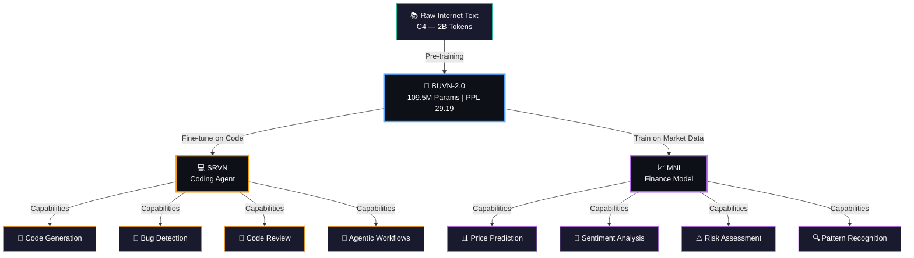
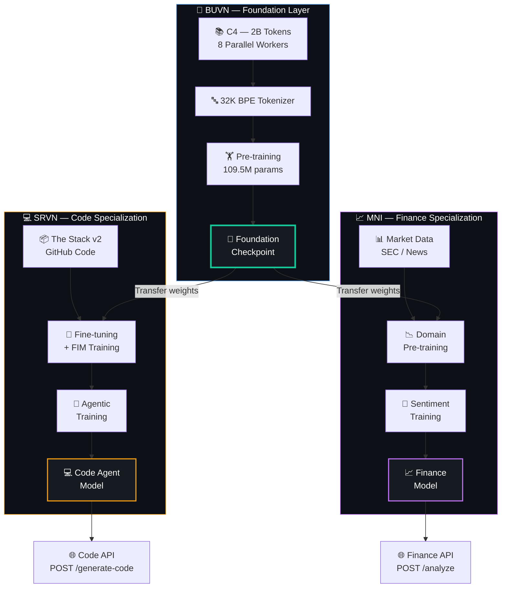

<!-- ═══════════════════════════════════════════════════════════════════════════
     🌐 Beuvian — AI Model Ecosystem
     Built from scratch by Bhuvan
═══════════════════════════════════════════════════════════════════════════ -->

<div align="center">

<!-- Animated SVG Header -->


<!-- Animated Typing -->
<a href="#">
  
</a>

<br/>

<!-- Badges -->
[](https://python.org)
[](https://pytorch.org)
[](https://fastapi.tiangolo.com)
[](https://huggingface.co/datasets)
[](LICENSE)

<br/>


<br/><br/>

[🧠 BUVN — Foundation](#-buvn--the-foundation) · [💻 SRVN — Code Agent](#-srvn--the-coder) · [📈 MNI — Finance](#-mni--the-analyst) · [🗺️ Roadmap](#-the-beuvian-roadmap) · [🚀 Quick Start](#-quick-start)

</div>

<br/>

<!-- Animated Divider -->


<br/>

## 🌐 What is Beuvian?

<table>
<tr>
<td width="55%">

**Beuvian** is not a single model — it's an **ecosystem of AI models** built from the ground up, each designed for a different domain of intelligence.

It starts with a single question: *What if one developer could build an entire AI model family from scratch — no pretrained weights, no shortcuts, no black boxes?*

The answer is Beuvian.

> *"Don't just use AI. Understand it. Build it. Own it."*

Every model in the Beuvian family shares the same DNA — the same transformer architecture, the same training philosophy, the same codebase. But each one evolves to master a different world.

</td>
<td width="45%">

```
         🌐 BEUVIAN ECOSYSTEM
         ═══════════════════

    ┌─────────────────────────┐
    │   🧠 BUVN (Foundation)  │
    │   General Intelligence  │
    │   "The Brain"           │
    └────────┬────────────────┘
             │
     ┌───────┴───────┐
     ▼               ▼
┌─────────┐   ┌─────────────┐
│ 💻 SRVN │   │  📈 MNI     │
│ Code    │   │  Finance    │
│ Agent   │   │  Analyst    │
│"Coder"  │   │ "Analyst"   │
└─────────┘   └─────────────┘
```

</td>
</tr>
</table>

<br/>

## 🧬 The Model Family

<div align="center">



</div>

<br/>

<!-- Animated Divider -->


<br/>

## 🧠 BUVN — The Foundation

<div align="center">


</div>

<br/>

<table>
<tr>
<td width="65%">

### What is BUVN?

**BUVN** (**B**h**UV**a**N**) is the **primary foundation model** — the beating heart of the entire Beuvian ecosystem. It is a GPT-style decoder-only transformer trained from scratch on raw internet text, designed to learn the fundamental patterns of human language.

Every other model in the Beuvian family **inherits from BUVN**. Just as GPT-3 gave birth to ChatGPT and Codex, BUVN gives birth to SRVN (code) and MNI (finance). The stronger the foundation, the stronger every specialization built on top of it.

**BUVN-2.0** is the latest release — **109.5M parameters** trained on **2 billion tokens** from C4 on an NVIDIA H100 NVL GPU. It achieves a **perplexity of 29.19**, beating GPT-2 Small (29.41), Pythia-160M (29.33), and GPT-Neo 125M (32.43) on the WikiText-103 benchmark. Trained in just ~2 hours with torch.compile and 8-worker parallel data streaming.

### Why Build a Foundation Model From Scratch?

Most developers fine-tune someone else's model and call it a day. Beuvian takes the harder path — building from raw text to trained weights — because:

- **Full understanding** — You can't truly master AI if you've never built the engine
- **Full control** — No license restrictions, no API rate limits, no vendor lock-in
- **Full customization** — Every layer, every hyperparameter, every training decision is yours
- **Foundation for specialization** — SRVN and MNI aren't built on borrowed weights; they're built on *your* weights

</td>
<td width="35%">

### Architecture

```
📝 Input Tokens
      ↓
  Embedding Layer
      ↓
  ┌──────────────┐
  │ Transformer  │ ×N
  │   Block      │
  │              │
  │ ● RMSNorm   │
  │ ● Attention  │
  │   + RoPE     │
  │ ● SwiGLU FFN│
  │ ● Residuals  │
  └──────────────┘
      ↓
  RMSNorm
      ↓
  Linear → Logits
      ↓
  📤 Next Token
```

### Key Specs

| | v1.1 (Test) | v2.0 (Prod) |
|---|:---:|:---:|
| **Params** | 13.7M | **109.5M** |
| **Layers** | 6 | **12** |
| **d_model** | 384 | **768** |
| **Vocab** | 8K | **32K** |
| **Context** | 512 | **1024** |
| **Data** | 13M tok | **2B tok** |
| **PPL** | 35.87 | **29.19** |

</td>
</tr>
</table>

### 🏆 BUVN-2.0 Results — Leaderboard Rank #8

| Rank | Model | Params | PPL | Data |
|:---:|-------|:---:|:---:|:---:|
| 6 | OPT-125M (Meta) | 125M | 27.65 | 300B |
| 7 | RWKV-169M | 169M | 29.01 | 300B |
| **8** | **BUVN-2.0 (ours)** | **109.5M** | **29.19** | **2B** |
| 9 | Pythia-160M | 160M | 29.33 | 300B |
| 10 | GPT-2 Small (OpenAI) | 124M | 29.41 | ~40B |

> **Beat GPT-2 Small with 9x fewer params and 20,000x less data.** The architecture works — the gap to higher ranks is purely about scale.

| Metric | Value |
|--------|:-----:|
| Top-1 Accuracy | 37.88% |
| Top-5 Accuracy | 60.34% |
| Training Throughput | 320K tok/s |
| Generation Speed | 204 tok/s (4.9 ms/tok) |
| MFU (H100) | 24% |
| Overfit Gap | 0.03 (healthy) |

<details>
<summary>📂 <b>Click to expand: Quick Start Pipeline</b></summary>
<br/>

```bash
# Clone & setup
git clone https://github.com/bhuvan0808/beuvian.git && cd beuvian/BUVN-1.1
pip install -r requirements.txt && export PYTHONPATH=$(pwd)

# Option A: Small test run (5 min on GPU)
python scripts/prepare_data.py --max_size_mb 50
python scripts/train_hf_tokenizer.py --vocab_size 8000
python scripts/tokenize_corpus.py
python training/train.py --config configs/train_gpu_small.yaml

# Option B: Production run (2 hrs on H100)
python scripts/prepare_parallel.py --num_workers 8 --target_tokens 2000000000
python training/train.py --config configs/train_125m.yaml --compile

# Inference & API
python inference/generate.py --prompt "The future of AI is" --checkpoint checkpoints/ckpt_best.pt --tokenizer tokenizer/tokenizer_32k.json
python api/app.py --checkpoint checkpoints/ckpt_best.pt --tokenizer tokenizer/tokenizer_32k.json
```

📘 **Full documentation:** [Setup](BUVN-1.1/docs/setup.md) · [Usage](BUVN-1.1/docs/usage.md) · [Training](BUVN-1.1/docs/training.md) · [Scaling](BUVN-1.1/docs/scaling.md) · [Fine-Tuning](BUVN-1.1/docs/fine-tuning.md) · [Architecture](BUVN-1.1/docs/architecture.md) · [Benchmarks](BUVN-1.1/docs/benchmarks.md)

</details>

<br/>

<!-- Animated Divider -->


<br/>

## 💻 SRVN — The Coder

<div align="center">


</div>

<br/>

<table>
<tr>
<td width="65%">

### What is SRVN?

**SRVN** (**S**a**RV**a**N**) is the **coding agent model** — a specialized descendant of BUVN, fine-tuned to understand, generate, debug, and reason about code. While BUVN speaks human language, SRVN speaks the language of machines.

SRVN isn't just a code autocompleter — it's designed to be an **agentic coding system** that can:

- **Understand codebases** — Parse, navigate, and comprehend entire repositories
- **Generate code** — Write functions, classes, and modules from natural language descriptions
- **Debug and fix** — Identify bugs, suggest fixes, and explain root causes
- **Review and refactor** — Analyze code quality, suggest improvements, detect anti-patterns
- **Execute workflows** — Chain together multi-step coding tasks autonomously (agentic mode)
- **Explain code** — Translate complex logic into clear, human-readable explanations

### How Will SRVN Be Built?

SRVN takes BUVN's pre-trained weights and continues training on a curated code corpus. This is **transfer learning in action** — the foundation model's understanding of language, logic, and structure gives SRVN a massive head start on understanding code.

**Training Strategy:**

| Phase | Data Source | Technique | Goal |
|-------|-----------|-----------|------|
| **Phase 1: Code Pre-training** | The Stack v2, GitHub Code | Continued pre-training | Learn syntax, patterns, and idioms across 20+ languages |
| **Phase 2: Instruction Tuning** | CodeAlpaca, Code-Instruct | Supervised fine-tuning (SFT) | Follow coding instructions: "Write a function that..." |
| **Phase 3: Agentic Training** | Tool-use datasets, ReAct traces | Reinforcement learning | Plan → Code → Test → Debug → Iterate autonomously |
| **Phase 4: Alignment** | Human preference data | DPO / RLHF | Prefer safe, readable, well-documented code |

</td>
<td width="35%">

### Target Capabilities

```
💻 SRVN Capabilities
═══════════════════

🔧 Code Generation
   Python, JS, Rust, Go,
   Java, C++, SQL, Bash...

🐛 Bug Detection
   Static analysis via LLM
   Root cause identification
   Auto-fix suggestions

📝 Code Review
   Quality scoring
   Anti-pattern detection
   Refactoring suggestions

🤖 Agentic Mode
   Multi-step task planning
   Tool use (shell, git, API)
   Self-correcting loops

📖 Code Explanation
   Line-by-line breakdown
   Architecture summaries
   Documentation generation
```

### Target Languages

| Priority | Languages |
|:---:|---|
| 🔴 | Python, JavaScript, TypeScript |
| 🟠 | Rust, Go, Java, C++ |
| 🟡 | SQL, Bash, C#, Ruby |
| 🟢 | Swift, Kotlin, Scala |

</td>
</tr>
</table>

<details>
<summary>🔬 <b>Click to expand: SRVN Technical Deep Dive</b></summary>
<br/>

### Data Pipeline

```
📦 Raw Code Sources                    🧹 Cleaning & Filtering              🔤 Code Tokenizer
═══════════════════                    ══════════════════════              ═══════════════════

The Stack v2 (3TB+)  ──┐              ● License filtering (permissive)    ● Extended BPE vocab
GitHub Public Code   ──┤──────────▶   ● Deduplication (MinHash)      ──▶  ● Code-aware tokens
CodeSearchNet        ──┤              ● Quality scoring (AST parse)       ● Whitespace handling
Programming books    ──┘              ● PII removal                       ● Multi-language support
                                       ● Min 10 lines, max 10K lines
```

### Architecture Modifications (from BUVN)

SRVN builds on BUVN's transformer architecture with code-specific enhancements:

| Component | BUVN (Base) | SRVN (Modified) |
|-----------|------------|----------------|
| Tokenizer | BPE 50K general | BPE 64K with code tokens (indentation, brackets, operators) |
| Context Window | 512 tokens | 4096 tokens (code files are longer than prose) |
| Training Objective | Next-token prediction | Next-token + Fill-in-the-Middle (FIM) |
| Special Tokens | `<BOS>`, `<EOS>`, `<PAD>` | + `<FIM_PREFIX>`, `<FIM_SUFFIX>`, `<FIM_MIDDLE>`, `<LANG:py>`, `<TOOL_CALL>` |
| Attention | Standard causal | + Repository-level cross-file attention (planned) |

### Fill-in-the-Middle (FIM) Training

SRVN will support infilling — predicting missing code in the middle of a file, not just at the end:

```python
# FIM training transforms:
# Original:
def factorial(n):
    if n <= 1:
        return 1
    return n * factorial(n - 1)

# FIM format (50% of training samples):
<FIM_PREFIX>def factorial(n):
    if n <= 1:
<FIM_SUFFIX>    return n * factorial(n - 1)<FIM_MIDDLE>        return 1
```

### Agentic Architecture

```
┌─────────────────────────────────────────────────────┐
│                    SRVN Agent Loop                   │
│                                                      │
│   📋 Task    ──▶  🧠 Plan    ──▶  💻 Code           │
│     ▲                                  │             │
│     │                                  ▼             │
│   📊 Review  ◀──  🐛 Debug   ◀──  🧪 Test           │
│                                                      │
│   Tools: [shell, git, file_read, file_write,         │
│           web_search, test_runner, linter]            │
└─────────────────────────────────────────────────────┘
```

### Evaluation Benchmarks

| Benchmark | What It Measures | Target Score |
|-----------|-----------------|:---:|
| HumanEval | Python function generation | > 25% pass@1 |
| MBPP | Basic programming problems | > 30% pass@1 |
| DS-1000 | Data science code generation | > 15% pass@1 |
| SWE-bench | Real GitHub issue resolution | > 5% resolved |
| CodeXGLUE | Code understanding tasks | Competitive |

</details>

<br/>

<!-- Animated Divider -->


<br/>

## 📈 MNI — The Analyst

<div align="center">


</div>

<br/>

<table>
<tr>
<td width="65%">

### What is MNI?

**MNI** (**M**o**NI**tor) is the **finance model** — a specialized descendant of BUVN, trained on stock market data, financial reports, economic indicators, and trading signals. While BUVN understands human language and SRVN understands code, MNI understands the language of markets.

Markets generate an ocean of data every second — price movements, volume patterns, order flows, earnings reports, news sentiment, macroeconomic signals. Most of this data is consumed by humans who can only process a fraction of it. MNI is designed to ingest it all, find the patterns humans miss, and surface actionable intelligence.

### What Makes MNI Different?

Unlike generic finance chatbots that just summarize news, MNI is designed to be a **multi-modal financial reasoning engine**:

- **Time-series understanding** — Process and predict sequential price/volume data natively
- **Sentiment analysis** — Parse earnings calls, SEC filings, financial news, and social media for market-moving signals
- **Pattern recognition** — Identify technical patterns (head & shoulders, cup & handle, breakouts) from raw price data
- **Risk assessment** — Quantify portfolio risk, detect anomalies, flag potential black swan indicators
- **Cross-asset correlation** — Understand how bonds, equities, commodities, and crypto interact
- **Report generation** — Produce institutional-grade research summaries and trade rationale

### How Will MNI Be Built?

MNI takes a **hybrid training approach** — combining BUVN's language understanding with domain-specific financial data:

**Training Strategy:**

| Phase | Data Source | Technique | Goal |
|-------|-----------|-----------|------|
| **Phase 1: Financial Pre-training** | SEC filings, earnings transcripts, financial textbooks | Continued pre-training | Learn financial vocabulary, accounting concepts, market structure |
| **Phase 2: Market Data Training** | Historical OHLCV, order books, tick data | Specialized tokenization + training | Understand price action, volume patterns, technical indicators |
| **Phase 3: Sentiment Training** | Financial news (Reuters, Bloomberg), Reddit/Twitter, analyst reports | Supervised fine-tuning | Extract sentiment, urgency, and impact from unstructured text |
| **Phase 4: Prediction Training** | Labeled market outcomes, backtested signals | Reinforcement learning with market rewards | Optimize for prediction accuracy and risk-adjusted returns |

</td>
<td width="35%">

### Target Capabilities

```
📈 MNI Capabilities
═══════════════════

📊 Price Prediction
   Short-term (1-5 days)
   Medium-term (1-3 months)
   Trend classification

📰 Sentiment Analysis
   News impact scoring
   Earnings call parsing
   Social media signals
   SEC filing analysis

⚠️ Risk Assessment
   Portfolio risk scoring
   Anomaly detection
   Drawdown prediction
   Volatility forecasting

🔍 Pattern Recognition
   Technical patterns
   Volume analysis
   Support/resistance
   Market regime detection

📋 Report Generation
   Research summaries
   Trade rationale
   Risk reports
   Market commentary
```

### Target Markets

| Priority | Asset Class |
|:---:|---|
| 🔴 | US Equities (NYSE, NASDAQ) |
| 🟠 | Indian Equities (NSE, BSE) |
| 🟡 | Forex (Major pairs) |
| 🟢 | Crypto (BTC, ETH, Top 20) |
| 🔵 | Commodities (Gold, Oil) |

</td>
</tr>
</table>

<details>
<summary>🔬 <b>Click to expand: MNI Technical Deep Dive</b></summary>
<br/>

### Data Pipeline

```
📦 Financial Data Sources              🧹 Processing & Alignment            🔤 Finance Tokenizer
══════════════════════                 ═════════════════════════            ══════════════════════

SEC EDGAR (10-K/Q)    ──┐             ● Timestamp alignment (UTC)          ● Extended BPE vocab
Yahoo Finance OHLCV   ──┤             ● Missing data interpolation         ● Numeric-aware tokens
Earnings Transcripts  ──┤─────────▶   ● Outlier detection/handling    ──▶  ● Ticker symbols
Financial News APIs   ──┤             ● Normalization (z-score/minmax)     ● Financial terms
Reddit r/wallstreetbets──┤             ● Deduplication                     ● Price format tokens
Alpha Vantage API     ──┘             ● Train/val/test temporal split      ● Date/time tokens
```

### Architecture Modifications (from BUVN)

MNI extends BUVN's transformer with finance-specific capabilities:

| Component | BUVN (Base) | MNI (Modified) |
|-----------|------------|----------------|
| Tokenizer | BPE 50K general | BPE 64K with financial tokens ($TSLA, +2.3%, Q3'24, EPS) |
| Context Window | 512 tokens | 2048 tokens (financial reports are lengthy) |
| Input Encoding | Text only | Text + Numeric embeddings (prices, volumes, ratios) |
| Special Tokens | `<BOS>`, `<EOS>`, `<PAD>` | + `<TICKER>`, `<PRICE>`, `<DATE>`, `<SENTIMENT:pos>`, `<SIGNAL>` |
| Output Heads | Single (next-token) | Multi-head: text generation + numeric regression + classification |
| Positional Encoding | RoPE | RoPE + Temporal encoding (market hours, trading days, earnings dates) |

### Multi-Modal Financial Input

MNI is designed to process financial data in a unified token stream:

```
<DATE:2026-03-28> <TICKER:AAPL> <PRICE:open=178.50,high=182.30,low=177.90,close=181.20,vol=45.2M>
<SENTIMENT:pos,score=0.82> Apple reported Q1 earnings beating estimates by 12%,
driven by strong iPhone 16 sales in emerging markets. Services revenue hit all-time
high of $23.1B. <SIGNAL:bullish,confidence=0.74> Price target raised to $210 by
Morgan Stanley citing AI integration catalyst.
```

### Evaluation Benchmarks

| Benchmark | What It Measures | Target |
|-----------|-----------------|:---:|
| Directional Accuracy | Next-day up/down prediction | > 55% |
| Sentiment F1 | Financial news sentiment classification | > 0.78 |
| Sharpe Ratio | Risk-adjusted returns of generated signals | > 1.5 |
| Report BLEU | Quality of generated research summaries | > 0.35 |
| Anomaly Detection AUC | Identifying unusual market behavior | > 0.80 |

### Risk & Compliance Considerations

| ⚠️ Consideration | 📋 Approach |
|:---:|---|
| Not financial advice | All outputs include disclaimers; model is a research/analysis tool |
| Backtesting bias | Walk-forward validation with out-of-sample testing |
| Market manipulation risk | No real-time trade execution; signal generation only |
| Data freshness | Designed for batch analysis, not HFT (high-frequency trading) |
| Regulatory compliance | SEC/SEBI-aware output formatting |

</details>

<br/>

<!-- Animated Divider -->


<br/>

## 🔬 How the Three Models Connect

<div align="center">



</div>

The relationship is hierarchical:

1. **BUVN trains first** — It learns the fundamental structure of language from raw text. This is the most expensive and time-consuming step, but it only happens once.

2. **SRVN and MNI inherit** — They start from BUVN's checkpoint (not from random weights), which means they already understand grammar, logic, reasoning, and world knowledge. Fine-tuning is faster and cheaper.

3. **Each model specializes** — SRVN sees millions of code files and learns programming. MNI sees market data and financial text and learns to think like an analyst. Their language understanding comes from BUVN; their domain expertise is their own.

4. **All share the same API** — Every model in the Beuvian family is served through the same FastAPI infrastructure with the same request/response format, making integration seamless.

<br/>

<!-- Animated Divider -->


<br/>

## 🗺️ The Beuvian Roadmap

<div align="center">

### From One Model to an Ecosystem

</div>

```
═══════════════════════════════════════════════════════════════════════════════════════

  PHASE 1 — FOUNDATION ✅ COMPLETE                                   🧠 BUVN
  ────────────────────────────────
  ✅ BUVN-1.1 released (13.7M params, H100, WikiText-103) — PPL 35.87
  ✅ BUVN-2.0 scaled to 109.5M params on H100 NVL (96GB VRAM)
  ✅ C4 dataset — 2B tokens streamed via 8 parallel workers (22 min)
  ✅ Perplexity 29.19 — BEATS GPT-2 Small (29.41)! Rank #8/11
  ✅ torch.compile — 24% MFU, 320K tok/s, ~2 hrs training
  🔄 Instruction tuning (SFT) on OpenAssistant + Alpaca — NEXT
  🔄 INT8/INT4 quantization for faster inference

═══════════════════════════════════════════════════════════════════════════════════════

  PHASE 2 — CODE INTELLIGENCE                                      💻 SRVN
  ───────────────────────────────
  📋 Curate code training corpus (The Stack v2, 500GB+)
  📋 Extend tokenizer with code-specific vocabulary (64K tokens)
  📋 Fine-tune BUVN checkpoint on code data
  📋 Implement Fill-in-the-Middle (FIM) training
  📋 Instruction-tune on coding task datasets
  📋 Build agentic framework (tool use, self-correction)
  📋 Benchmark on HumanEval, MBPP, SWE-bench
  📋 Deploy as coding assistant API

═══════════════════════════════════════════════════════════════════════════════════════

  PHASE 3 — FINANCIAL INTELLIGENCE                                  📈 MNI
  ────────────────────────────────
  📋 Build financial data pipeline (SEC EDGAR, Yahoo Finance, news APIs)
  📋 Design numeric-aware tokenization for price/volume data
  📋 Domain pre-train BUVN on financial corpus
  📋 Train sentiment analysis on earnings calls and news
  📋 Build market prediction head (regression + classification)
  📋 Backtest signal quality with walk-forward validation
  📋 Deploy as financial analysis API
  📋 Build dashboard for real-time market intelligence

═══════════════════════════════════════════════════════════════════════════════════════

  PHASE 4 — ECOSYSTEM INTEGRATION                                   🌐 ALL
  ────────────────────────────────
  📋 Unified Beuvian API gateway (route to BUVN/SRVN/MNI)
  📋 Cross-model orchestration (SRVN writes quant strategies, MNI evaluates them)
  📋 Model versioning and A/B testing infrastructure
  📋 HuggingFace Hub publication for all models
  📋 Web playground for interactive demos
  📋 Community fine-tuning guides and LoRA adapters

═══════════════════════════════════════════════════════════════════════════════════════
```

<br/>

<!-- Animated Divider -->


<br/>

## 📂 Repository Structure

```
beuvian/                                    🌐 Beuvian Ecosystem (this repo)
│
├── 📘 README.md                            You are here — ecosystem overview
│
├── 🧠 BUVN-1.1/                           Foundation Language Model (v2.0)
│   ├── model/                              Transformer architecture (109.5M params)
│   ├── training/                           Training pipeline (AdamW, cosine LR, AMP)
│   ├── inference/                          Text generation (top-k, top-p, temperature)
│   ├── api/                                FastAPI deployment (POST /generate)
│   ├── scripts/                            Pipeline: data, tokenizer, training, benchmark
│   ├── configs/                            train_125m.yaml, train_gpu_small.yaml
│   ├── docs/                               7 comprehensive guides (setup → fine-tuning)
│   └── README.md                           Full BUVN documentation
│
├── 💻 SRVN/ (coming soon)                  Coding Agent Model
│   ├── fine_tuning/                        Code fine-tuning pipeline
│   ├── agent/                              Agentic workflow engine
│   ├── evaluation/                         HumanEval, MBPP benchmarks
│   └── README.md                           SRVN documentation
│
├── 📈 MNI/ (coming soon)                   Finance Model
│   ├── data_pipeline/                      Market data ingestion
│   ├── training/                           Financial domain training
│   ├── analysis/                           Sentiment & prediction modules
│   └── README.md                           MNI documentation
│
└── 🌐 gateway/ (coming soon)               Unified API Gateway
    ├── router/                             Model routing logic
    ├── auth/                               API key management
    └── dashboard/                          Web playground
```

<br/>

## 🚀 Quick Start

```bash
# Clone the ecosystem
git clone https://github.com/bhuvan0808/beuvian.git
cd beuvian

# Start with BUVN (the foundation)
cd BUVN-1.1
pip install -r requirements.txt
export PYTHONPATH=$(pwd)

# Run the full pipeline (see BUVN-1.1/README.md for details)
python scripts/prepare_data.py --max_size_mb 300
python scripts/train_hf_tokenizer.py --vocab_size 8000
python scripts/tokenize_corpus.py
python training/train.py --config configs/train_config.yaml
python inference/generate.py --prompt "The future of AI is"
```

<br/>

## 💻 Hardware Requirements

<div align="center">

| Model | Minimum | Recommended | Cloud Option |
|:---:|---------|-------------|-------------|
| 🧠 **BUVN** (test) | Any CPU, 8 GB RAM | GPU, 16 GB | — |
| 🧠 **BUVN** (prod) | 1× A100 40 GB | 4× A100 80 GB | Azure NC A100 v4 |
| 💻 **SRVN** | 1× A100 40 GB | 2× A100 80 GB | Azure NC A100 v4 |
| 📈 **MNI** | 1× A100 40 GB | 2× A100 80 GB | Azure NC A100 v4 |

</div>

<br/>

## ⚠️ Disclaimers

| ⚠️ | Disclaimer |
|:---:|---|
| 🧠 | BUVN is a research foundation model — not instruction-tuned, may generate incoherent or incorrect text |
| 💻 | SRVN (when released) is a coding assistant — always review generated code before using in production |
| 📈 | MNI (when released) is **not financial advice** — it is a research/analysis tool; always consult qualified professionals for investment decisions |
| 🔒 | No models in the Beuvian ecosystem should be used for generating harmful, deceptive, or manipulative content |

<br/>

<!-- Animated Divider -->


<br/>

<div align="center">

<!-- Animated Footer -->


**Built with ❤️ by Bhuvan**

*Beuvian — One foundation. Three intelligences. Infinite possibilities.*

<br/>


</div>
